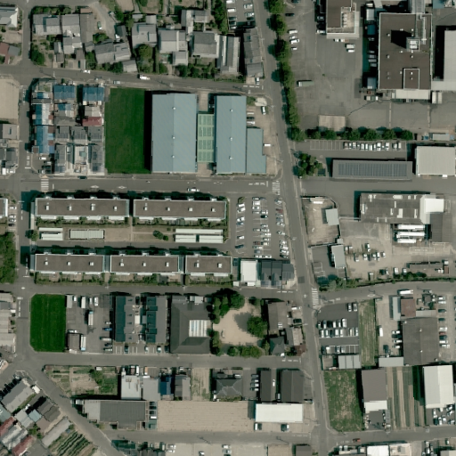
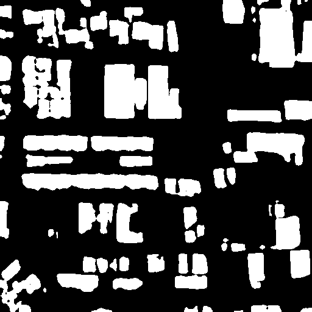
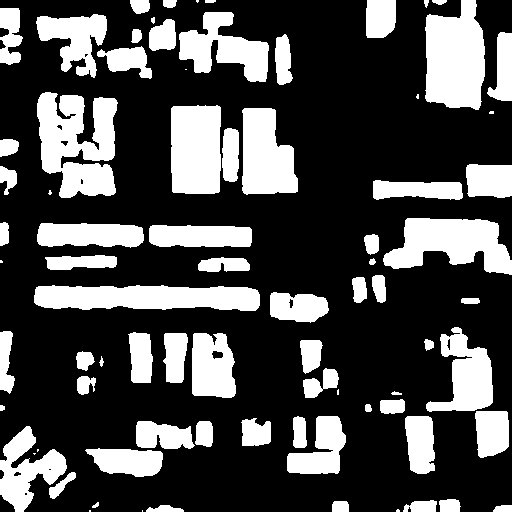
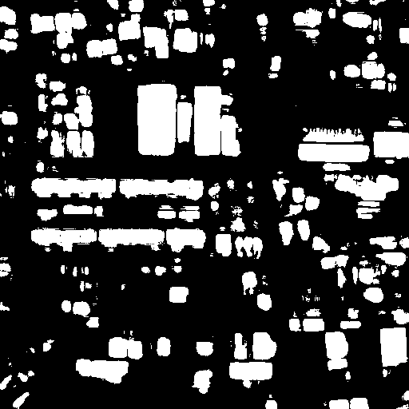

# Exercise on Building Detection
### Description
This is my second assignment for course Remote Sensing Image Analysis at the University of Tokyo.
|Input image|Swin-S|Twins-FPN|U-Net
|---|---|---|---|
||||

### Model Configurations
| Method | Backbone | Crop Size | Lr schd | Mem (GB) | Inf time (fps) | mIoU | mIoU(ms+flip) | config | download |
| ------ | -------- | --------- | ------: | -------: | -------------- | ---: | ------------- | ------ | -------- |
|Segformer | MIT-B0 | 512x512 | 160000 | 2.1 | 51.32 | 37.41 | 38.34 | [config](Swin-S.log) | [log](Swin-S.log.json) |
|Segformer | MIT-B1 | 512x512 | 160000 | 2.6 | 47.66 | 40.97 | 42.54 | [config](Twins.log) | [log](Twins.log.json) |
### Usage
The assignment is based on the tools provided by open-mmlab. Please refer to [MMSegmentation](https://github.com/open-mmlab/mmsegmentation) for instruction.
### References
1.MMSegmentation Contributors, MMSegmentation: OpenMMLab Semantic Segmentation Toolbox and Benchmark [https://github.com/open-mmlab/mmsegmentation](https://github.com/open-mmlab/mmsegmentation), 2020.
2.Liu *et al.*, "Swin transformer: Hierarchical vision transformer using shifted windows," *arXiv preprint arXiv:2103.14030*, 2021.