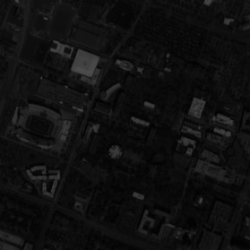
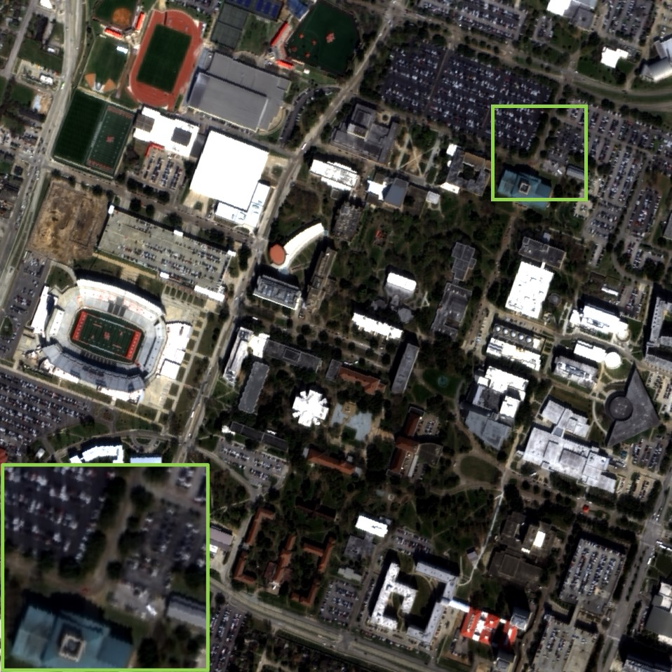
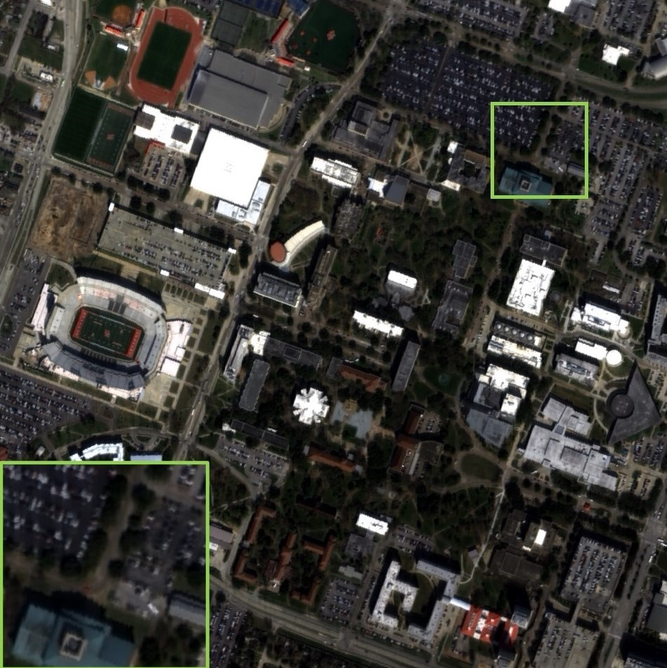

# Exercise on Panchromatic Sharpening
### Description
This is my first assignment for course Remote Sensing Image Analysis at the University of Tokyo.
|Original PAN (GSD: 1m)|GLP-Reg_FS (GSD: 4m)|Gram-Schmidt (GSD: 4m)
|---|---|---|
|||

### To Demonstrate on MATLAB
1. Use the ./GLP-Reg_FS/Sythesize-Full-Scale.ipynb to synthesize the full scale (FS) multispectral (MS) data into 'mul.tif'.
2. Run 'run.m' using 'mul.tif' and MS datasets.
3. Run 'tiffw.m' to decompose the fused pan-sharpened into 4 single band data.
4. Use ENVI software to sytheszie the final RGB image. 
### References
This assignment reproduce the paper: G. Vivone *et al.*, "Full Scale Regression-Based Injection Coefficients for Panchromatic Sharpening," *IEEE Transactions on Image Processing*, 27(7):3418–3431, 2018, doi: [10.1109/TIP.2018.2819501](https://ieeexplore.ieee.org/abstract/document/8325487).
