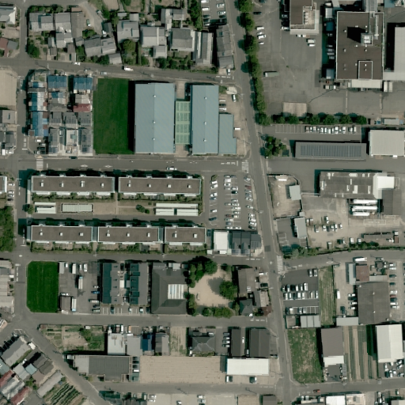
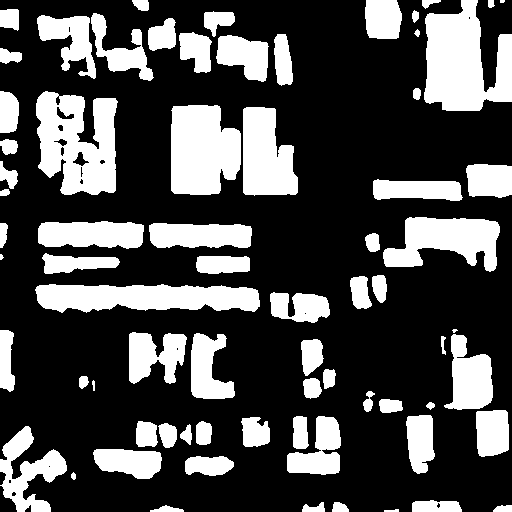
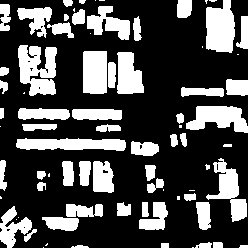
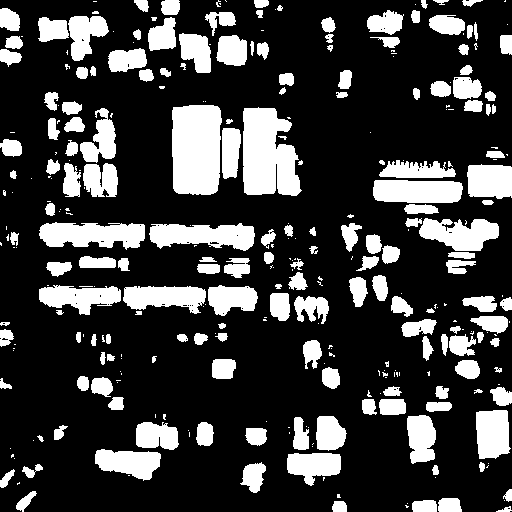

# Exercise on Building Detection
### Description
This is my second assignment for course Remote Sensing Image Analysis at the University of Tokyo.
|Input image|Swin-S|Twins-FPN|U-Net|
|---|---|---|---|
|||||

### Model Configurations
| Method | Backbone | Pretrain | Lr schd | Batch Size | config | log |
| ------ | -------- | --------- | ------ | ----- | -------------- | -------- |
| UperNet| Swin-S | ImageNet-1K | 10000 | 4 | [config](Swin-S.log) | [log](Swin-S.log.json) |
|Twins-FPN | SVT-S | ADE-20K | 10000 | 8 | [config](Twins.log) | [log](Twins.log.json) |
### Usage
The assignment is based on the tools provided by open-mmlab. Please refer to [MMSegmentation](https://github.com/open-mmlab/mmsegmentation) for instruction.
### References
* MMSegmentation Contributors, MMSegmentation: OpenMMLab Semantic Segmentation Toolbox and Benchmark. [https://github.com/open-mmlab/mmsegmentation](https://github.com/open-mmlab/mmsegmentation), 2020.
* Liu *et al.*, "Swin transformer: Hierarchical vision transformer using shifted windows," *arXiv preprint arXiv:2103.14030*, 2021.