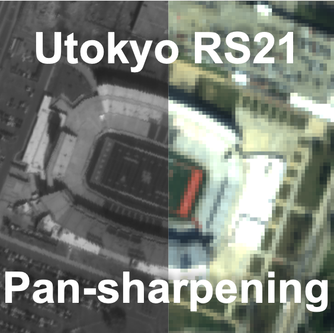
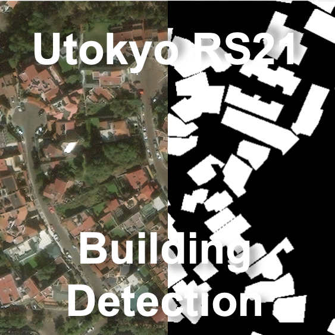

# UTokyo-GFS-CS6048L1
### Description
My Assignments Submitted to Course GFS-CS6048L1 (21Fall) : Remote Sensing Image Analysis, The University of Tokyo.  
For reference purpose only.
|[Pan Sharpening](https://github.com/YuHoChau/UTokyo-GFS-CS6048L1/tree/mater/Assignment%201)|[Building Detection](https://github.com/YuHoChau/UTokyo-GFS-CS6048L1/tree/mater/Assignment%202)|
|---|---|
|||
### Copyright  
© Graduate School of Frontier Sciences, The University of Tokyo, 2021. All rights reserved.

